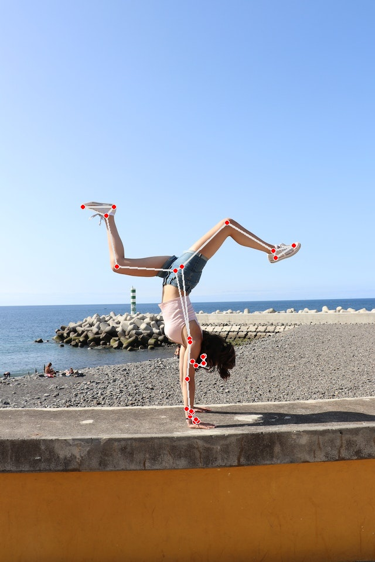

# Pose_Estimation
This project contains Full Body estimation, Face Tracking and Hand Estimation all using mediapipe library. These projects were done with help of [freeCodeCamp.org](https://www.youtube.com/watch?v=01sAkU_NvOY) video.

## Body_Estimations
  
This contains the module [body_estimation_module.py](./Body_Estimation/Codes/body_tracking_module.py) which can be used to track the landmarks on a human body. It is limited to tracking a single person at a time and gives 33 unique landmarks on the body.

### Usage
To use the [body_estimation_module.py](./Body_Estimation/Codes/body_tracking_module.py) go to `Body_Estimation` directory in terminal
- For default execution:  
`python3 Codes/bodytracking_module.py`
- To execute with an image  
`python3 Codes/bodytracking_module.py -p Data/Images/handstand.jpg`
- To execute on a video  
`python3 Codes/bodytracking_module.py -v -p Data/Videos/dance.mp4`

## Hand_Estimation
  
This contains the module [hand_tracking_module.py](./Hand_Estimation/Codes/hand_tracking_module.py) which can be used to track the landmarks on hand(s) and also display them. It can track maximum of 2 handas at an instant.

### Usage
To use the [hand_tracking_module.py](./Hand_Estimation/Codes/hand_tracking_module.py) go to `Hand_Estimation` directory in terminal
- For default execution:  
`python3 Codes/hand_tracking_module.py`
- To execute with an image  
`python3 Codes/hand_tracking_module.py -p Data/Images/covered_face.jpg`
- To execute on a video  
`python3 Codes/hand_tracking_module.py -v -p Data/Videos/piano_playing.mp4` 

## Face_Tracking
  
This contains the module [face_tracking_module.py](./Face_Estimation/Codes/face_tracking_module.py) which can be used to detect and track the face by drawing a bounding box around it. To detect faces at farther range set model type to 1.

### Usage
To use the [face_tracking_module.py](./Face_Estimation/Codes/face_tracking_module.py) go to `Face_Estimation` directory in terminal
- For default execution:  
`python3 Codes/face_tracking_module.py`
- To execute with an image  
`python3 Codes/face_tracking_module.py -p Data/Images/human_3.jpg`
- To execute on a video  
`python3 Codes/face_tracking_module.py -v -p Data/Videos/humans_1.mp4` 

## Face_Mesh_Detection
  
This contains the module [face_mesh_detection_module.py](./Face_Estimation/Codes/face_mesh_detection_module.py) which can be used to detect and track the face by drawing a mesh on it around it. Max 2 faces can be detected.

### Usage
To use the [face_mesh_detection_module.py](./Face_Estimation/Codes/face_mesh_detection_module.py) go to `Face_Estimation` directory in terminal
- For default execution:  
`python3 Codes/face_mesh_detection_module.py`
- To execute with an image  
`python3 Codes/face_mesh_detection_module.py -p Data/Images/human_2.jpg`
- To execute on a video  
`python3 Codes/face_mesh_detection_module.py -v -p Data/Videos/humans_2.mp4` 
